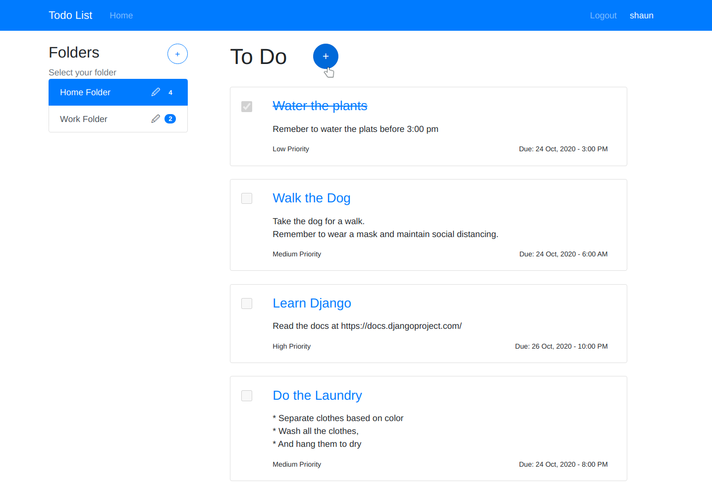
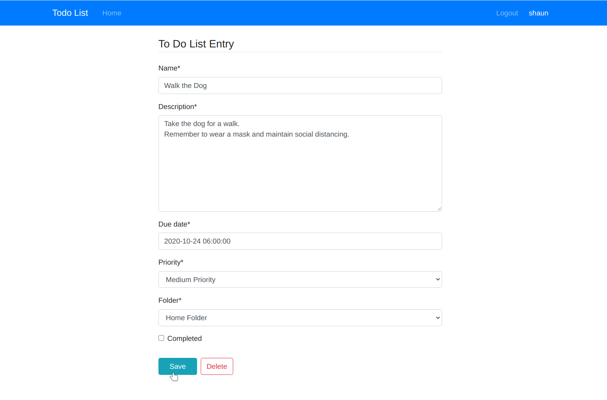

# Todo-List-Website

#### A To Do List website written in Django.

<br>

* The website has user authentication, so each person's lists stay private.
* Each To-Do entry has a title, description, due date, priority, and a completed flag.
* Everything can be categorized into separate folders.
* Users have the option to create, update, and delete Folders and To-Do entries.
* User authentication is necessary, and nothing can be accessed without loging in.
* Trying to access an entry that does not belong to you through its url, will result in a 403 error.
* All the pages are well organized and easily navigable.
* A Docker file is provided for easy and convinient setup

## Quickstart

* Download and install [Docker](https://www.docker.com/)
* git clone this repository: 
```bash
git clone https://github.com/Shaun-Fernandes/Todo-List-Website.git
```
* Navigate to the directory:
```bash
cd Todo-List-Website
```
* Run docker compose:
```bash
docker-compose up
```
* Finally, open [localhost:8000](http://localhost:8000) in your browser and you will be able to access the website.

## Results
#### Users are first greeted with a registration page, then prompted to login


#### On the home page, users are presented with their list of folders, and the entire contents of each.



#### Each of the Entries can be edited and updated as required.


